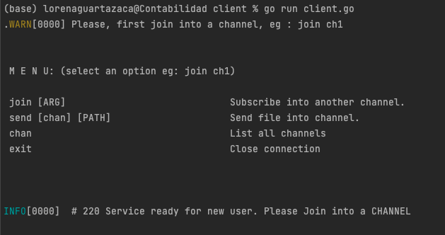
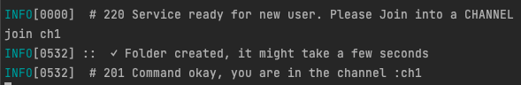
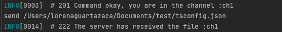
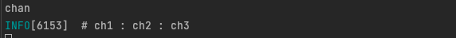
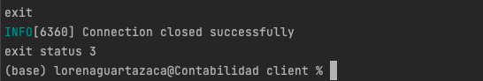
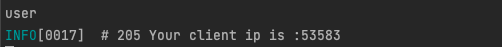

## INTRO
This project tries to elaborate a server in golang that will allow to transfer files between two or more clients using TCP protocol.

### - Official documentation https://go.dev/ and the steps to install golang on your machine:
### - Download golang https://go.dev/dl/
### - Download project go get github.com/lorenaggs/golang

## RAISE ENVIRONMENT
1. Raise server environment with go run main.go
2. Raise client environment with go run client.go

### 2.1. COMMANDS ACCEPTED IN CLIENTS
   

### 2.1.1. join [ARG]
The program has 3 predefined channels (ch1, ch2 and ch3, you can be consulted by entering the command "chan"), once the server and client environment is created, the client can join one of these channels with the command "join ch1".

### 2.1.2. send [chan] [PATH]
To send a file to another client you use the "send [chan] [PATH] command" (you can send it to a different channel than the one you have joined) and it will notify other clients that they have joined the channel.

### 2.1.3. chan

The chan command lists available channels that clients can join.

### 2.1.4. exit
The "exit" command allows you to close the connection with the server and log out

### 2.1.5. user
The "user" command that shows you the id of the user you have.

## DIAGRAM OF SEQUENCE

